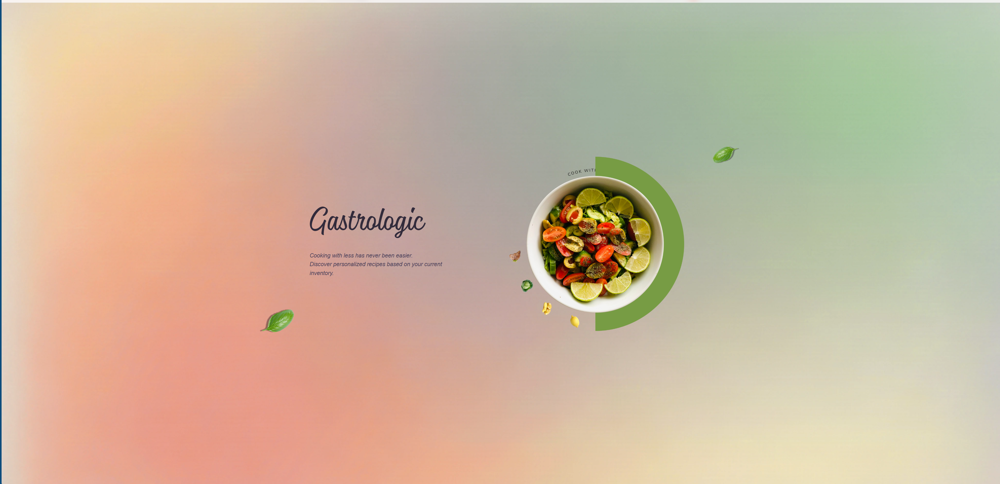
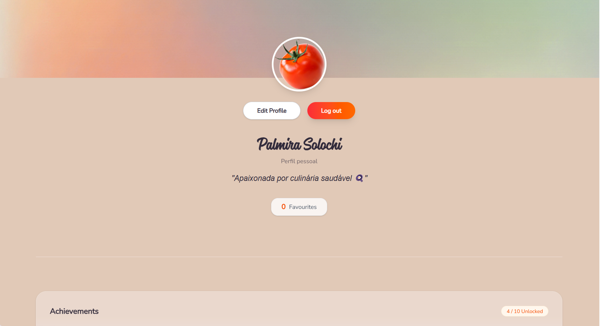
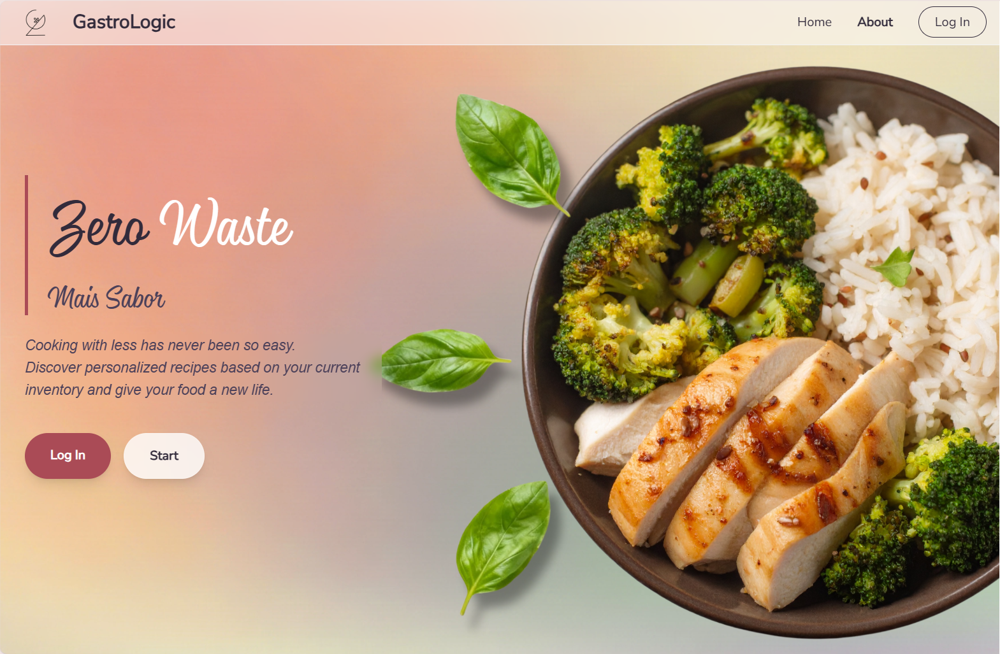
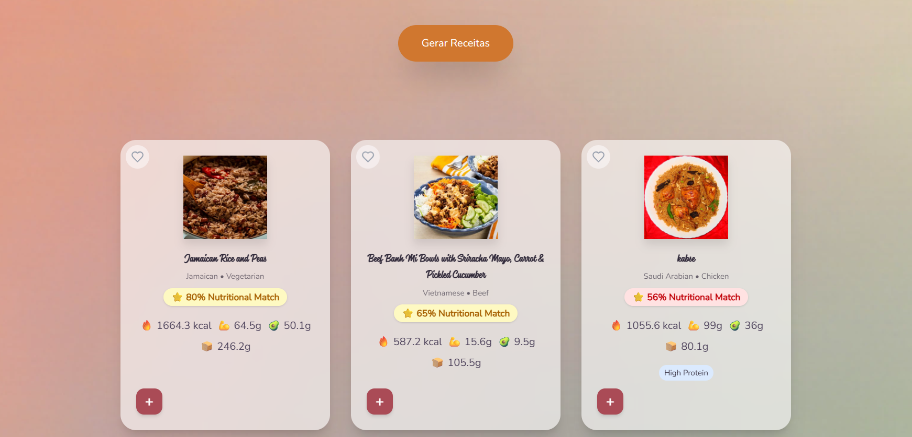

🍽️ GastroLogic
<p align="center">  </p> <p align="center"> AI Smart Recipe Recommendation Platform </p>

📸 Screenshots
🏠 Home
<p align="center">
  
</p>

<p align="center">
  
</p>

<p align="center">
  
</p>

## 🎯 About

GastroLogic is an intelligent recipe recommendation platform that suggests meals based on available ingredients, helping users reduce food waste and maintain healthier eating habits.
The system integrates multiple nutrition APIs and applies a scoring algorithm to deliver personalized recipe recommendations.

## ✨ Features

Smart recipe recommendation
Ingredient based filtering
Nutrition profile selection
Vegan / Vegetarian filters
Ingredient substitution
Scoring algorithm
JWT authentication
Responsive UI
Multi API fallback
Performance optimization

## 🏗️ Architecture
```
Frontend (React + Vite + Tailwind)
            │
            ▼
Backend API (Node.js + Express)
            │
            ▼
Database (SQLite + Prisma)
            │
            ▼
External APIs
 ├── TheMealDB
 ├── USDA FoodData
 ├── OpenFoodFacts
 └── Spoonacular
 ```

 ## ⚙️ Tech Stack
Frontend
React
Vite
Tailwind CSS
Backend
Node.js
Express
Database
SQLite
Prisma ORM
APIs
TheMealDB
USDA FoodData
OpenFoodFacts
Spoonacular

## 🧪 How It Works
User inserts ingredients
System searches recipes (TheMealDB API)
Extracts recipe ingredients
Fetches nutrition data (USDA API)
Calculates macros and calories
Applies scoring algorithm
Ranks recipes by compatibility
Displays smart recommendations

## 📂 Project Structure
```
GastroLogic
│
├── frontend
│   ├── pages
│   ├── components
│   ├── services
│   └── styles
│
├── backend
│   ├── controllers
│   ├── services
│   ├── repositories
│   ├── routes
│   └── prisma
│
└── docs
```

## 👩‍💻 Team
```
Palmira Solochi — Backend
Carolina — Frontend
Michael — Database
```

## 🚀 Run Locally

Backend
cd backend
npm install
npm run dev

Frontend
cd frontend
npm install
npm run dev

## 📊 Project Status

✅ Completed
✅ Presented to jury
✅ Fully functional
✅ Academic final project

## 🎯 Highlights
Clean architecture
API integration
Scoring algorithm
Nutrition analysis
Ingredient matching logic
Fullstack implementation
Responsive UI

## 📄 License

MIT License

Copyright (c) 2026 Palmira Solochi, Carolina Pereira, Michael Ortiz

This project was developed for academic purposes.


